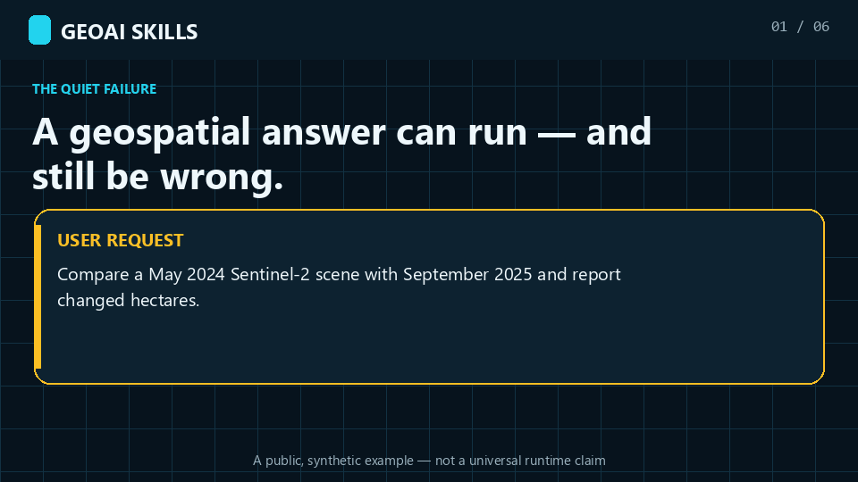
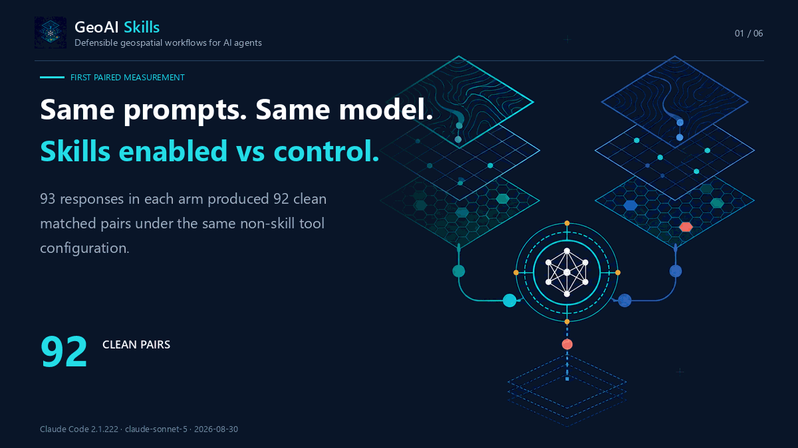

# GeoAI Skills


## Geospatial AI should know when not to answer

**A command can succeed while the geographic claim is still wrong.**

GeoAI Skills is a vendor-neutral collection of 18
[Agent Skills](https://agentskills.io) for the methodological layer between a
user request and a geospatial claim. The skills do not replace GDAL, PostGIS,
Earth Engine, ArcGIS, QGIS, Python libraries, or MCP servers. They tell an agent
which preconditions must hold, which checks must run, what evidence must be
reported, and when the available data cannot support the requested conclusion.

[](https://github.com/muend/geoai-skills/actions)
[](LICENSE)
[](#the-18-skill-stack)
[](BENCHMARK.md)
[](BENCHMARK.md)
[](benchmarks/claude-code-2.1.222--claude-sonnet-5--520bc41dd4c0/README.md)
[](benchmarks/claude-code-2.1.222--claude-sonnet-5--520bc41dd4c0/README.md)
[](https://www.skills.sh/muend/geoai-skills)
[](https://agentskills.io)

Two measurements are shown above and they are deliberately not pooled. The
routing card covers 167 cases on Claude Code `2.1.214`, `claude-sonnet-5`, suite
`efe27d8c1736…`. The behavior package covers 92 clean pairs on Claude Code
`2.1.222`, the same model name, and suite `520bc41dd4c0…`. Both describe **one
runtime/model pair** and are **not universal or model-independent claims**. The
behavior figures are model-judged, uncalibrated, and not yet human-verified.

<p align="center">
  
</p>

<p align="center">
  <strong>Success is a defensible claim — or a justified stop.</strong><br />
  <a href="#quick-start">Install</a>
  ·
  <a href="#what-makes-this-different">See the boundary</a>
  ·
  <a href="#evidence-with-boundaries">Inspect the evidence</a>
  ·
  <a href="assets/demo/geoai-claim-gate-poster.png">Static poster</a>
</p>

The animation uses a public, synthetic request. It demonstrates the method the
skills encode; it does not claim that every runtime will produce identical text.

## Quick start

Install all 18 skills for Codex:

```bash
npx skills add muend/geoai-skills --skill '*' -a codex
```

Or install one specialist for Claude Code:

```bash
npx skills add muend/geoai-skills \
  --skill remote-sensing-analysis \
  -a claude-code
```

Then ask naturally:

> Can May 2024 and September 2025 Sentinel-2 scenes support a defensible
> changed-hectares claim?

The relevant specialist should test observation comparability before proposing
pixel arithmetic. In this example the season mismatch blocks a defensible
two-date area claim, so the useful answer is not a fabricated number: it is the
reason to stop and the evidence needed to continue.

## What makes this different

There are real neighboring projects. The difference is center of gravity, not a
claim that every other skill collection is interchangeable or inferior.

| Public project | Its strongest center of gravity | How GeoAI Skills differs |
|---|---|---|
| [OpenMapStack](https://github.com/jaakla/openmapstack) | An open-first, reproducible GIS project contract with a CLI, templates, artifact validation, and worked output | GeoAI Skills is not an execution framework. It supplies separately routed method specialists across proprietary and open stacks, with claim-narrowing and refusal conditions before or around execution. |
| [geospatial-skills](https://github.com/isaaccorley/geospatial-skills) | Separately installable skills for tools, formats, catalogues, viewers, and large-scale pipelines | GeoAI Skills organizes around analytical decisions and failure modes—leakage, comparability, inference, uncertainty, measurement, and safe mutation—rather than a tool catalogue. |
| [GIS Agent Skills](https://github.com/danmaps/gis-agent-skills) | Practical ArcGIS/GIS workflow, readiness, schema, publishing, and post-run checklists | GeoAI Skills spans the full data-to-claim lifecycle and evaluates cross-skill routing boundaries as well as behavior. |
| [MapLibre Agent Skills](https://github.com/maplibre/maplibre-agent-skills) and [Mapbox Agent Skills](https://github.com/mapbox/mapbox-agent-skills) | Deep platform-specific mapping implementation; MapLibre also distinguishes eval-verified and provisional skills | GeoAI Skills is platform-neutral and extends beyond application delivery into remote sensing, spatial inference, geostatistics, accessibility, ML validation, LiDAR, terrain, and databases. |
| [GeoMaster](https://github.com/K-Dense-AI/scientific-agent-skills/tree/main/skills/geomaster) | One broad, example-rich geospatial science skill | GeoAI Skills splits ownership across 18 narrow specialists so activation, collisions, negative routes, and domain boundaries can be tested independently. |

What is unusual here is the combination:

1. **Claim preconditions, not only API knowledge.** A result must survive CRS,
   unit, validity, comparability, leakage, uncertainty, and provenance checks.
2. **A safe failure mode.** Missing evidence produces a narrower claim,
   clarification, provisional plan, or refusal—not invented certainty.
3. **Routed specialists.** One large geospatial prompt is not loaded for every
   task; domain ownership and collisions are explicit and tested.
4. **Published misses.** Routing evidence, paired behavior evidence, known
   regressions, execution errors, costs, suite hashes, and the failed quality
   gate remain visible.

Choose OpenMapStack when you want its executable open-stack project contract.
Choose a platform collection when that platform is the problem. Use GeoAI Skills
when the hard question is whether the method and evidence can support the claim
at all. These projects can complement one another.

## What changes when the skills are present

| A plausible shortcut | GeoAI Skills guardrail |
|---|---|
| Measure area in EPSG:4326 because the operation returns a number. | Select and record an appropriate projected CRS; verify units before reporting area or distance. |
| Randomly split spatial samples and report a high validation score. | Audit spatial and group leakage; use blocked validation and show geographic error structure. |
| Count changed pixels from two convenient dates. | Check season, sensor, processing level, registration, mutual masks, threshold sensitivity, and error-adjusted area uncertainty. |
| Sum overlapping spatial intersections. | Dissolve or deduplicate overlap before measurement and preserve an auditable accounting path. |
| Render a map and assume it communicates honestly. | Check projection, classification, palette accessibility, legend semantics, uncertainty, and export metadata. |
| Run a destructive local GIS mutation immediately. | Inspect first, plan the mutation, require an explicit gate, verify outputs, and retain recovery evidence. |

The skills complement tools and runtimes. They are the method and verification
layer that tells an agent **when not to trust an apparently successful
operation**.

## Evidence with boundaries

<p align="center">
  
</p>

### First paired behavior measurement

The first behavior package compares skills enabled and disabled under the same
runtime, model, prompts, and non-skill tool configuration. Of 93 responses in
each arm, 92 formed clean matched pairs.

| Measure | Skills enabled | Control | Paired result |
|---|---:|---:|---|
| Criterion coverage | **145/302 (48.0%)** | **85/302 (28.1%)** | 65 wins / 5 losses / 232 ties; `p = 2.2e-14` |
| Cases meeting every criterion | **18/92** | **6/92** | 42 wins / 3 losses / 47 ties; `p = 8.7e-10` |
| Critical spatial failures | **4/92 (4.3%)** | **13/92 (14.1%)** | 3.25× fewer observed failures |
| Forbidden-behavior violations | **0** | **0** | no separation |
| Skill activation | **92/92** | **0/92** | clean control arm |

Two facts must travel together:

- **The paired effect is large in this run.** The enabled arm wins 65 of the 70
  discordant criterion comparisons, and observed critical spatial failures fall
  from 13 cases to 4.
- **The absolute quality level is not good enough.** The enabled arm covers 48%
  of pinned criteria, but only 18/92 cases (19.6%) meet every criterion, and the
  critical-failure rate is 4.3%. The repository's Phase 3 gate applies to that
  case-level pass rate: it requires at least 85% plus less than 2% critical
  failures. It fails both conditions.

**We published the gate we failed.**

This is a single, different-family model judgment (`gpt-5.6-sol`, low reasoning)
of responses from `claude-sonnet-5`. It is uncalibrated and has no completed
human verification. Forty-seven arm-blinded human review packets are prepared;
until adjudication lands, these figures are evidence about this run, not a claim
of human-verified overall answer quality. Raw response text remains unpublished
to avoid contaminating that review; hashes and lengths preserve identity.

Read the
[behavior evidence package](benchmarks/claude-code-2.1.222--claude-sonnet-5--520bc41dd4c0/README.md)
for provenance, ties, criterion structure, the excluded termination case, cost,
tokens, and limitations. The historical routing-only label
`behavior_quality-not_evaluated` applies to the earlier routing card—not to the
repository's current evidence inventory.

### Four evidence layers, kept separate

| Evidence layer | Current coverage | What it supports |
|---|---:|---|
| Routing benchmark | **167 cases** across 18 skills; 105 development and 62 held-out | Activation precision/recall, negative routes, collisions, and known boundary defects |
| Paired behavior measurement | **92 clean pairs**, 302 pinned criteria | Model-judged criterion coverage and critical failures for one runtime/model/run |
| GeoAnalystBench-derived external subset | **5 executable cases** with deterministic synthetic fixtures and artifact validators | Transfer checks for network analysis, facility coverage, vegetation change, urban heat/kriging, and spatial regression |
| Platform and package verification | Windows, macOS, and Linux CI; clean installs for Codex, Claude, Skills CLI, and GitHub Copilot | Packaging, portability, runtime-file isolation, and deterministic archives |

The routing card and behavior package use different Claude Code versions and
different suite hashes; do not combine their metrics. The external subset is
independently authored and reported separately. It does not copy upstream
datasets, prompts, or reference implementations, and its results are never
pooled with native metrics. See its
[frozen suite and offline result protocol](evals/external/geoanalystbench/README.md).

The routing-only run recorded **99.17% precision, 96.77% recall, and 96.41%
full-route accuracy** on suite `efe27d8c1736…`, with zero control activations.
It also recorded one false positive, four false negatives, one incomplete route,
and eleven execution errors; all remain in the card. Routing says which skill
loaded, not whether the answer was correct.

Read [BENCHMARK.md](BENCHMARK.md) for routing and known defects, and
[EVALUATION.md](EVALUATION.md) for the provider-neutral prepare → execute →
judge → score → compare protocol and publication gates.

If you want measured, pre-registered evidence like this to keep being published,
star the repository so the work is easier to find and sustain.

## The 18-skill stack

| Stage | Skills | What they protect |
|---|---|---|
| Route and acquire | [`geoai-orchestrator`](skills/geoai-orchestrator/SKILL.md), [`geo-data-engineering`](skills/geo-data-engineering/SKILL.md), [`google-earth-engine`](skills/google-earth-engine/SKILL.md) | Problem decomposition, provenance, formats, CRS, scale, and server-side execution |
| Sense and prepare | [`remote-sensing-analysis`](skills/remote-sensing-analysis/SKILL.md), [`point-cloud-lidar`](skills/point-cloud-lidar/SKILL.md), [`terrain-hydrology`](skills/terrain-hydrology/SKILL.md), [`movement-trajectory`](skills/movement-trajectory/SKILL.md) | Sensor/processing-level comparability, masks, elevation surfaces, point-cloud semantics, and trajectory cleaning |
| Model and detect | [`geo-deep-learning`](skills/geo-deep-learning/SKILL.md), [`change-detection`](skills/change-detection/SKILL.md), [`ml-experiment-standards`](skills/ml-experiment-standards/SKILL.md) | Leakage, chipping, imbalance, registration, threshold sensitivity, spatial validation, and reproducibility |
| Analyze and decide | [`spatial-statistics`](skills/spatial-statistics/SKILL.md), [`geostatistics-interpolation`](skills/geostatistics-interpolation/SKILL.md), [`mcda-suitability-analysis`](skills/mcda-suitability-analysis/SKILL.md), [`network-accessibility-analysis`](skills/network-accessibility-analysis/SKILL.md), [`postgis-spatial-sql`](skills/postgis-spatial-sql/SKILL.md) | Weights, inference, multiple testing, kriging uncertainty, AHP consistency, routing barriers, overlap, SQL correctness, and performance |
| Deliver and operate | [`cartography-geoviz`](skills/cartography-geoviz/SKILL.md), [`swe-devops-standards`](skills/swe-devops-standards/SKILL.md), [`arcgis-pro-automation`](skills/arcgis-pro-automation/SKILL.md) | Honest visual encoding, production code, test/transaction discipline, and gated local ArcGIS mutations |

Install the full suite for cross-skill routing, or cherry-pick one specialist.
Every skill must remain safe and useful alone; sibling references are advisory
and critical safeguards have local fallbacks.

## Installation

Choose the surface you already use.

| Surface | Recommended path |
|---|---|
| OpenAI Codex | `npx skills add muend/geoai-skills --skill '*' -a codex` |
| Claude Code | `claude plugin marketplace add muend/geoai-skills` then `claude plugin install geoai@geoai-skills` |
| GitHub Copilot | `gh skill install muend/geoai-skills remote-sensing-analysis` |
| Skills CLI / compatible agents | `npx skills add muend/geoai-skills` |
| ChatGPT | Install **GeoAI Skills** from the OpenAI Plugins Directory when available to your account |
| Claude.ai / Claude desktop | Upload one or more release ZIP files from the latest GitHub Release |

<details>
<summary><strong>Skills CLI and skills.sh</strong></summary>

Browse the collection on [skills.sh](https://www.skills.sh/muend/geoai-skills)
or inspect it without installing:

```bash
npx skills add muend/geoai-skills --list
```

Install all 18 skills for Claude Code:

```bash
npx skills add muend/geoai-skills --skill '*' -a claude-code
```

Install all 18 skills for Codex:

```bash
npx skills add muend/geoai-skills --skill '*' -a codex
```

Run `npx skills add muend/geoai-skills` without flags for the interactive agent
and skill picker.

</details>

<details>
<summary><strong>OpenAI Codex / ChatGPT plugin</strong></summary>

The repository's OpenAI plugin manifest is version `0.4.0`. The repository is a
skills-only plugin: it adds no hosted service, authentication flow, or MCP
server. Directory rollout can lag the source manifest.

Build the deterministic upload archive:

```bash
python tools/build_openai_plugin_bundle.py
```

The ignored `dist/` output contains only the plugin manifest, public policy
pages, logo, and runtime skill files. Evaluation cases, benchmark traces,
repository automation, and private development material are excluded.

</details>

<details>
<summary><strong>Claude Code and Claude Cowork</strong></summary>

From a terminal:

```bash
claude plugin marketplace add muend/geoai-skills
claude plugin install geoai@geoai-skills
```

From an interactive Claude Code session:

```text
/plugin marketplace add muend/geoai-skills
/plugin install geoai@geoai-skills
```

Installed skills use the stable `geoai` namespace, for example:

```text
/geoai:remote-sensing-analysis
```

</details>

### GitHub Copilot

GitHub Copilot can load project skills from `.github/skills`, `.claude/skills`,
or `.agents/skills`. With GitHub CLI 2.90.0 or later, preview before installing:

```bash
gh skill preview muend/geoai-skills remote-sensing-analysis
gh skill install muend/geoai-skills remote-sensing-analysis
```

The Skills CLI also provides an explicit Copilot target:

```bash
npx skills add muend/geoai-skills \
  --skill remote-sensing-analysis \
  -a github-copilot
```

See GitHub's
[Agent Skills documentation](https://docs.github.com/en/copilot/how-tos/copilot-on-github/customize-copilot/customize-cloud-agent/add-skills)
for supported locations, pinning, provenance, and security guidance.

<details>
<summary><strong>Claude.ai ZIP files and generic Agent Skills runtimes</strong></summary>

For Claude.ai or Claude desktop, download individual skill ZIP files and
`SHA256SUMS` from the latest GitHub Release, then upload them through
*Customize → Skills → Create skill → Upload a skill*.

To build the same deterministic archives locally:

```bash
python tools/build_skill_archives.py
```

Any Agent-Skills-compatible runtime can instead copy directories from `skills/`
into its skill directory. Real `arcgis-pro-automation` execution additionally
requires Windows, licensed ArcGIS Pro, and a configured local
[`arcgis-mcp-bridge`](https://github.com/muend/arcgis-mcp-bridge).

</details>

Release maintainers should use [RELEASING.md](RELEASING.md) for the
non-publishing candidate workflow, clean-install matrix, evidence requirements,
publication gate, and rollback procedure.

## Try these prompts

### Reject an invalid change claim

> Plan a defensible two-date Sentinel-2 forest-loss workflow. One scene is from
> May 2024 and the other from September 2025. Decide whether this comparison can
> support a changed-hectares claim.

Expected intervention: identify the phenology mismatch; withhold the hectare
claim; request matched-season imagery or a season-aware time series; require
registration, mutual masks, sensitivity analysis, and error-adjusted area
uncertainty.

### Make spatial SQL measurable and index-safe

> Design production-safe PostGIS SQL to return flooded area in hectares per
> parcel for two large EPSG:4326 polygon tables. Include invalid-geometry
> handling and an EXPLAIN verification plan.

Expected intervention: select a suitable projected measurement CRS, avoid
transforming indexed columns inside predicates, repair derived working geometry,
deduplicate overlaps, and verify the query plan.

### Refuse inconsistent suitability weights

> Use this AHP pairwise matrix to build a solar-suitability map. Its consistency
> ratio is 0.19.

Expected intervention: reject the weights before mapping, identify discordant
judgments, require revision, and preserve sensitivity analysis as a deliverable.

## How it works

1. **Trigger narrowly.** Specialist descriptions identify the domain decision
   that owns the task; negative and collision cases test over-triggering.
2. **Load progressively.** The agent reads only the relevant `SKILL.md`, then
   loads references or scripts when required.
3. **Enforce invariants.** CRS, validity, leakage, units, uncertainty,
   provenance, verification, and failure behavior travel across the workflow.
4. **Route across specialists.** The orchestrator coordinates genuine
   multi-stage work without replacing specialist judgment.
5. **Fail loudly.** Missing inputs produce a narrower claim, provisional plan,
   clarification, or refusal—not invented evidence.

## Design principles

1. **Fail-loud spatial computing.** Successful execution is not proof of a valid
   geographic result.
2. **Methodological honesty.** Uncertainty, multiple-testing correction,
   sensitivity, and error-adjusted estimates are first-class outputs.
3. **Anti-leakage by default.** Spatial and grouped validation replace random
   splits whenever geographic generalization is claimed.
4. **Tool-pragmatic, vendor-neutral guidance.** Open Python, PostGIS/DuckDB,
   Earth Engine, ArcGIS, and other backends are selected by evidence and scale.
5. **Progressive disclosure.** Long references and scripts cost no context until
   the task actually needs them.
6. **Measured, not assumed.** Source cases, run evidence, suite hashes, errors,
   costs, limitations, and superseded results remain distinguishable.

<details>
<summary><strong>Repository structure</strong></summary>

```text
geoai-skills/
├── skills/<skill-name>/
│   ├── SKILL.md
│   ├── agents/openai.yaml
│   ├── scripts/
│   └── references/
├── evals/cases/<skill>/       # native development-only cases
├── evals/external/            # separately reported transfer suites
├── tools/                     # validators, adapters, builders, and gates
├── benchmarks/                # immutable published evidence packages
├── .codex-plugin/             # OpenAI skills-only plugin manifest
├── .claude-plugin/            # Claude marketplace and plugin manifests
├── BENCHMARK.md               # routing card and limitations
├── EVALUATION.md              # provider-neutral evaluation protocol
├── CASE_STUDIES.md            # evidence policy and accepted cases
└── RELEASING.md               # release and rollback runbook
```

</details>

## Contributing

Contributions are welcome. Start with [CONTRIBUTING.md](CONTRIBUTING.md).
A skill change should:

- pass the structural and link validators;
- add or update evaluation cases;
- avoid duplicating canonical cross-cutting rules;
- define verification and failure behavior; and
- keep runtime packages free of benchmark and private development material.

Real-world catches belong in [CASE_STUDIES.md](CASE_STUDIES.md) only when they
include a dated, privacy-safe reproducer, comparison evidence, verification
method, and limitations.

## License

[MIT](LICENSE) — use it, fork it, and ship it.
